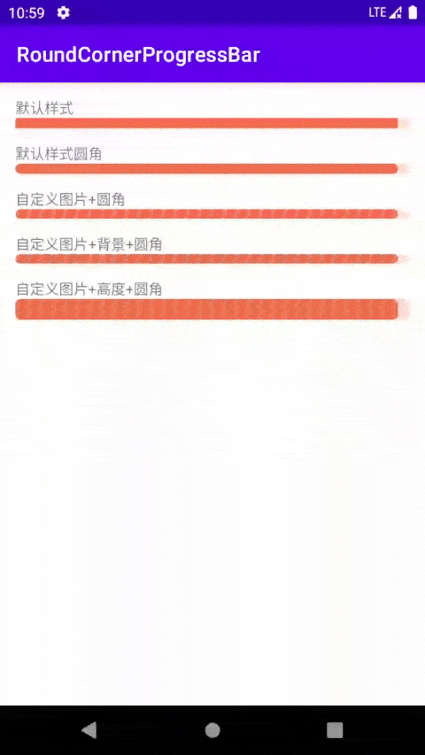

支持自定义进度条图片和自定义进度条背景图片，默认直角，可以随意设置进度条高度和圆角大小。
进度条图片只需要中间裁剪一小段可重复平铺的图片作为进度条图片或者背景图片即可， 组件会自动平铺并进行两端圆角处理，同时兼容进度过小的情况。



# gradle引入方法
Add it in your root build.gradle at the end of repositories:

	allprojects {
		repositories {
			...
			maven { url 'https://jitpack.io' }
		}
	}
Step 2. Add the dependency

	dependencies {
	        implementation 'com.github.dongyonghui:RoundCornerProgressBar:1.0.2'
	}

# 使用

在布局中引入
```xml
<com.dyh.android.tileimage.TileImageProgressBar
    android:layout_width="match_parent"
    android:layout_height="wrap_content"
    tipb:tipbBackgroundImage="@mipmap/icon_progressbar_red_tran"
    tipb:tipbCornerRadius="5dp"
    tipb:tipbMaxProgress="100"
    tipb:tipbProgress="30"
    tipb:tipbProgressImage="@mipmap/icon_progressbar_red" />
```
# 属性说明

| 属性 | 说明 | 必选 |
|--|--|--|
| tipbBackgroundImage | 进度条背景图片 | 否 |
| tipb:tipbCornerRadius | 进度条圆角大小 | 否 |
| tipb:tipbMaxProgress | 进度条最大值 | 否 |
| tipb:tipbProgress | 进度条默认值 | 否 |
| tipb:tipbProgressImage | 进度条图片 | 否 |

# Java 代码相关设置方法
```java
/**
 * 设置圆角大小，默认为0
 *
 * @param mCornerRadius
 */
public void setCornerRadius(float mCornerRadius) 

/**
 * 设置进度大小
 *
 * @param progress
 */
public void setProgress(int progress) 

/**
 * 设置进度条最大值，默认100
 *
 * @param maxProgress
 */
public void setMaxProgress(int maxProgress) 

/**
 * 设置进度条图片
 *
 * @param drawable
 */
public void setImageDrawable(Drawable drawable) 

/**
 * 设置进度条图片
 *
 * @param bm
 */
public void setImageBitmap(Bitmap bm) 


/**
 * 设置进度条图片
 *
 * @param resId
 */
public void setImageResource(int resId)


/**
 * 设置背景图片
 *
 * @param resId
 */
public void setBackgroundImageResource(int resId)

/**
 * 设置背景图片
 *
 * @param bm
 */
public void setBackgroundImageBitmap(Bitmap bm) 

/**
 * 设置背景图片
 *
 * @param drawable
 */
public void setBackgroundImageDrawable(Drawable drawable) 
```
